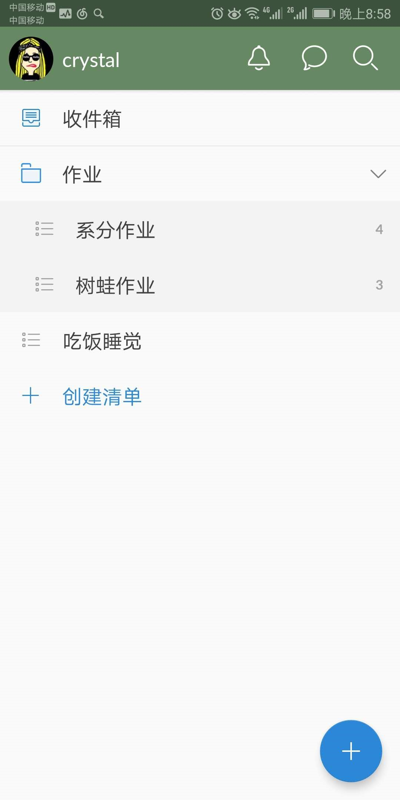
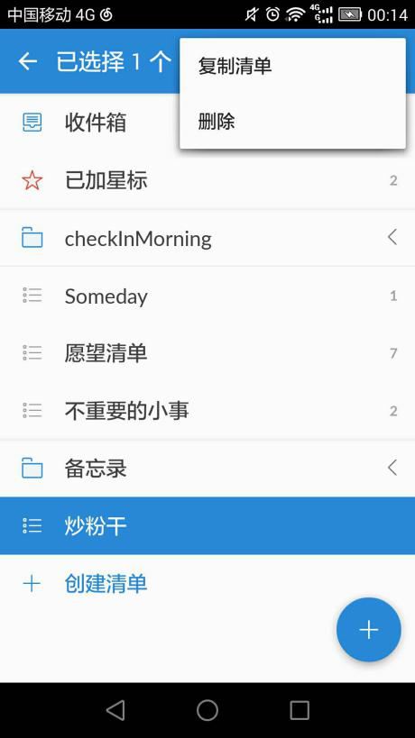
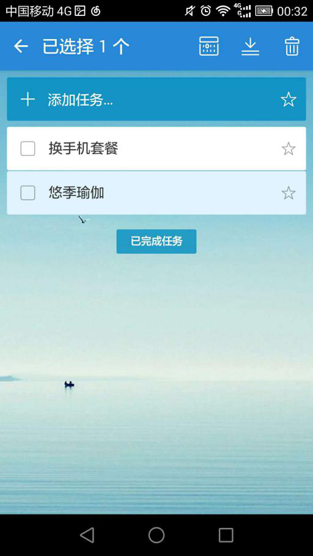
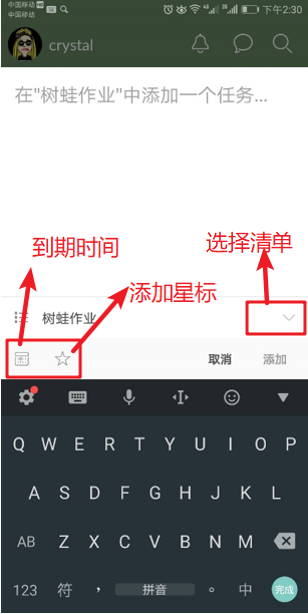

# "奇妙清单"业务文档

## Part I：简介
奇妙清单是一款跨平台的GTD软件，帮助用户完成所有个人和职业的待办事项。用户能够随时随地记录所有工作，定时收到任务截止日期的提醒，与其他人共享清单协作工作。

奇妙清单的核心是清单和任务功能。先简述两个概念，1）清单夹：类似于文件夹，将相似主题的清单包含一起；2）清单：类似于文件，一份清单会包含一个或多个任务，同时一份清单可以被零个或一个清单夹所包含。

## Part II：新建清单及任务
截图1是用户所创建的清单夹和清单列表。

 【截图1】

点击截图1清单列表下方的“创建清单”条目进入截图2界面，填写清单的名称、成员并选择清单选项，就可以创建一个新的清单。 

【截图2】

创建清单成功后，点击清单进入截图3界面，用户可以直接在输入框中编辑添加一个或多个任务，如截图4所示。 

【截图3】 【截图4】

创建好任务后，可以对每一个任务作具体描述。点击某一任务条目进入截图5界面，用户可以设置当前任务的到期时间、提醒时间、提醒频率，添加子任务、备注、文件和评论。 

【截图5】

## Part III：清单管理
清单建好后可以进入截图7（类似截图2）的清单信息编辑页，有两个入口，一是在截图1所示主页长按清单，在顶部出现的按钮中点击铅笔状图标；二是进入清单详情页后点击右上角抽屉按钮选择编辑清单，如截图6所示。
【截图6】 【截图7】

删除清单的入口也有两个，一是主页长按，选择抽屉按钮展开，如截图8；一个是截图7所示先进入编辑再删除。复制清单的两个入口也分别展示在截图6和8的抽屉菜单中，点击后，主页的清单列表会相应地增加一个相同的清单。
【截图8】

## Part IV：清单内容管理（即任务管理）
清单详情页可以选择对任务排序，如截图9所示顶部有排序按钮，可选择排序方式；可直接在任务右侧给任务星标；在左侧勾选某项任务表示完成，此时可以选择是否显示已完成任务。
【截图9】

当然可以进入截图5所示页面修改任务描述，或者点击底部的隐藏按钮进行删除。在清单详情页也可以长按某项任务，会发现标题栏变成截图10所示，能够直接修改任务的到期时间，移动任务到别的文件夹，以及永久性删除任务（区别于勾选完成）。
【截图10】

## Part V：其他重要便捷功能
添加任务还有一个快捷入口，即首页的加号悬浮按钮，点击后进进入截图11界面。可以在这里选择所属清单，设置时间和星标。是先想到任务再思考分类，满足用户不同的习惯。
【截图11】

搜索功能支持对所有任务的名称和描述进行搜索（不可以搜清单名），用户点击截图1右上角的搜索图标进入截图12所示搜索结果界面。
【截图12】

最后，任何修改均可云端同步。