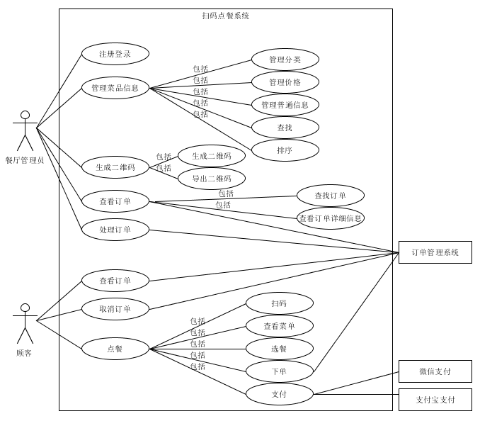

# 用例图
下图为整个系统的用例一览，在img_use_case文件夹中亦有各个子用例图。

# 用例文本与活动图
整个系统按照业务划分为下面几个用例，用例文本引用了子用例图，并添有必要的活动图辅助说明。  
**基本用例：**  
 -  [注册登录](register_login.md)：一个餐厅作为一个店铺用户注册并登录系统。
 -  [管理菜色信息](manage_dishes.md)：餐厅上传餐厅信息（餐厅简介、广告语）、食品信息（价格、数量、介绍、图片），并允许实时改动菜色信息。
 -  [生成每桌二维码](generating_two_dimensional_code.md)：餐厅管理员用系统为每张餐桌生成二维码。
 -  [查看订单](check_order.md)：依据某些条件查询得到历史订单的详细信息。
 -  [接单并生成票据](operate_order.md)：餐厅收到点餐信息（桌号、餐饮类型与数量、备注），以及用户的付款，根据信息打印票据。
 -  [点餐](make_order.md)：顾客进入餐厅，用手机扫描桌上二维码，系统显示点餐菜单。顾客选择餐饮种类以及数量，添加备注，点击结算、支付。

**扩展用例：**  
 - 呼叫服务员：顾客在点餐界面有个呼叫服务员按钮，一按餐厅端的服务员便收到信息（桌号、时间）。
 - 催单：点餐后过了好久都没上菜，顾客可以在点餐界面点击催单按钮，餐厅端收到催单信息（桌号、时间）。

**选做用例：**（第一个可用版本之前不考虑）
 - 多人点单：同一桌的多个顾客同时用手机扫描二维码，系统显示点餐菜单，顾客可以同时点餐，并将点餐数据统一到一份点餐信息上，发送到餐厅端。
 - 多人支付：支持AA支付法，每个顾客支付各自的部分。
 - 餐厅营业：查询近期账单（各菜色的销量、收入）。

下面是主成功场景下顾客和商家使用的活动图，在更多活动图见img_activity文件夹。
 