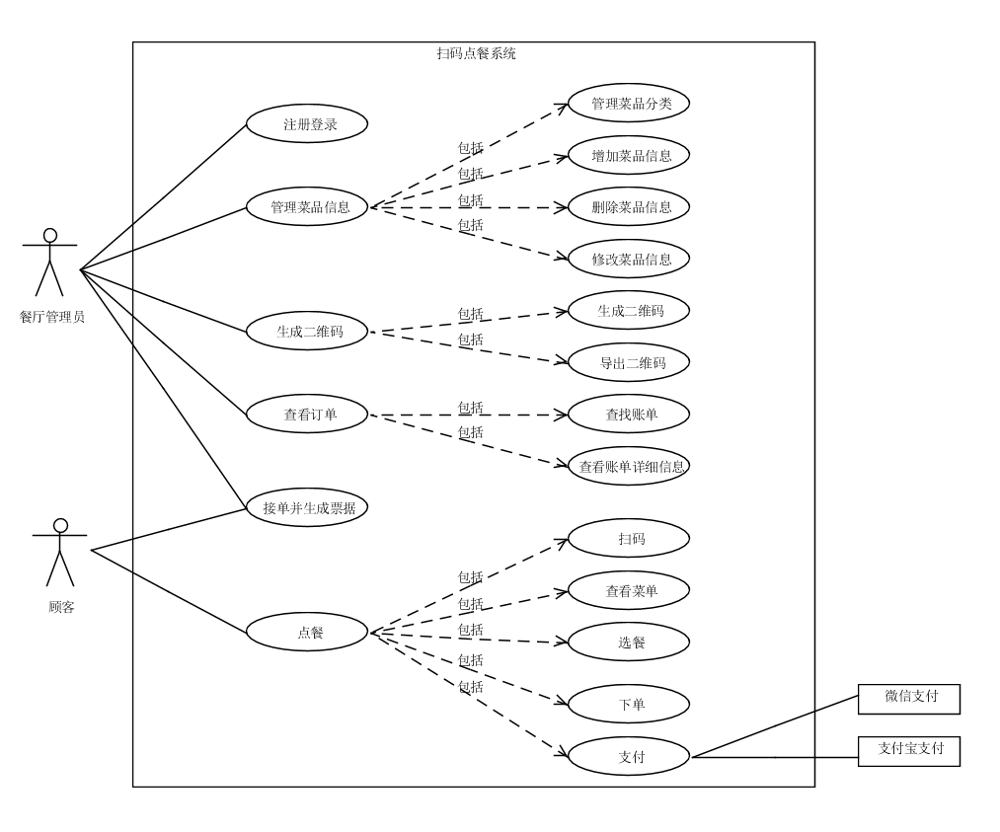
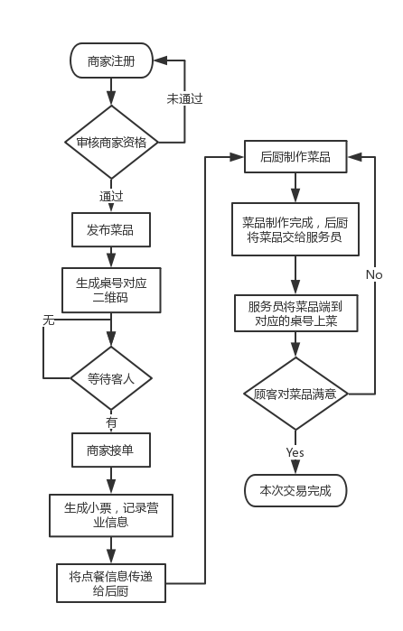

# 用例图
下图为整个系统的用例一览，在img_use_case文件夹中亦有各个子用例图。

# 用例文本简介
整个系统按照业务划分为下面几个用例，用例文本引用了子用例图，并添有必要的活动图辅助说明。  
**基本用例简介：**  
 -  [注册登录](register_login.md)：一个餐厅作为一个店铺用户，可以注册、登录系统。
 -  [管理菜色信息](manage_dishes.md)：餐厅管理员可以对菜色信息进行管理，可以增加菜色信息（菜品分类、菜品）、删除菜色信息（菜品分类、菜品）、修改菜色信息（菜品分类、菜品）、查看菜色信息（菜品分类、菜品）。
 -  [生成每桌二维码](generating_two_dimensional_code.md)：餐厅管理员可以用系统为餐厅的每一张餐桌生成独特的二维码（供用户扫码点餐）。
 -  [查看订单](view_the_order.md)：餐厅管理员通过查询限制条件（订单时间、订单号、订单状态），查询得到符合条件的历史订单，并允许查看每一条历史订单的详细信息。
 -  [接单并生成票据](operate_order.md)：餐厅收到顾客的点餐信息（桌号、餐饮类型与数量、备注），以及用户的付款，可以选择拒绝或接受，若接受则根据信息打印票据。
 -  [点餐](make_order.md)：顾客进入餐厅就坐，用手机扫描贴在桌上二维码，手机显示出该餐厅的点餐菜单。顾客可以选择餐饮种类以及数量、添加备注，下单，点击结算、支付，完成点餐。

**选做用例简介：**（第一个可用版本之前不考虑）

- 多人点单：当有多个顾客聚餐时，允许多人同时用手机扫描同一张桌子二维码，每个人的手机都显示出点餐菜单，顾客可以同时点餐，并将点餐数据统一到一份点餐订单上，发送到餐厅端。
- 餐厅营业：餐厅管理员可以查询近期账单（各菜色的销量、收入）。
- 多人支付：当有多个顾客聚餐时，支持AA支付法，每个顾客支付各自的部分。

 - 呼叫服务员：顾客在小程序端的点餐界面有个呼叫服务员按钮，一按餐厅端（网页端）的服务员便收到信息（桌号、时间）。
- 催单：顾客点餐后过了好久都没上菜，可以在小程序的点餐界面点击催单按钮，餐厅端（网页端）收到催单信息（桌号、时间）。

下面是主成功场景下顾客和商家使用的活动图，在更多活动图见img_activity文件夹。

#活动图

 