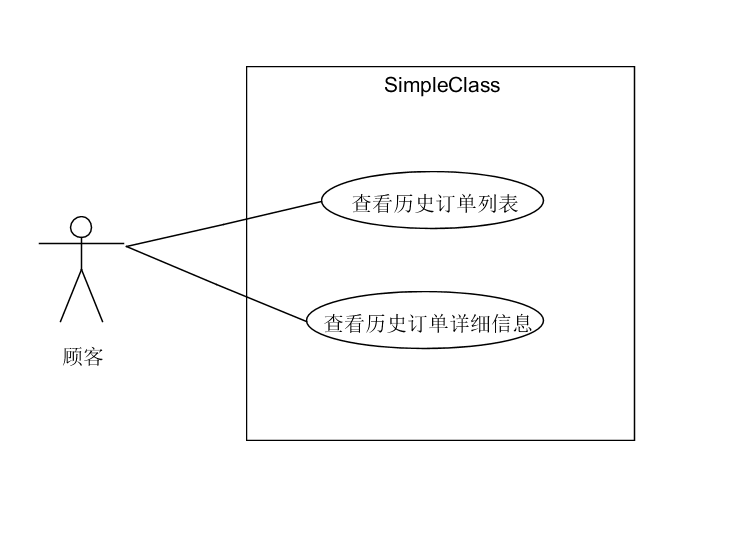

作者：15331365

|     用例名称     | 查看订单                                     |
| :----------: | :--------------------------------------- |
|      范围      | web应用                                    |
|      级别      | 用户目标                                     |
|    主要参与者     | 顾客                                       |
|   涉众及其关注点    | 顾客：希望能准确地看到自己的历史订单，以及详细的订单信息。            |
|     前置条件     | 每次成功订单的信息（订单号、时间、金额、最终状态、餐桌号）都能被准确录入系统。  |
| 成功保证（或后置条件）  | 准确、清晰地显示对应时间的订单信息。                       |
| 主成功场景（或基本流程） | 1. 顾客在小程序端点击进入历史订单界面，显示历史订单。 2. 顾客点击某一订单，会跳转到该订单的详细信息界面。 |
|  扩展（或替代流程）   | 1a. 顾客没有下过单：     1. 显示为空。             |
|     特殊需求     | 订单信息的显示要能适应各种手机屏幕大小，清晰地显示。               |
|   技术和数据元表    | 1a. 从数据库中得到相应的信息，并以列表的形式显示在顾客的手机界面上。     |
|     发生频率     | 可能会经常发生。                                 |
|     未决问题     | 1.  故障恢复修改问题。                            |