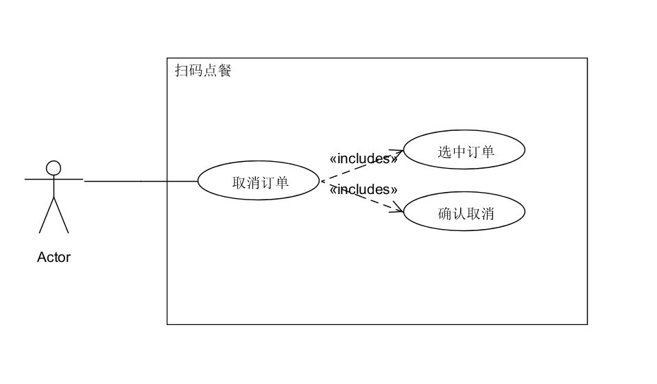

作者：15331365

|     用例名称     | 生成每桌二维码                                  |
| :----------: | :--------------------------------------- |
|      范围      | web应用                                    |
|      级别      | 用户目标                                     |
|    主要参与者     | 顾客                                       |
|   涉众及其关注点    | 顾客：希望能准确、简便地取消订单。                        |
|     前置条件     | 顾客已经下好单，但是商家端未作出答复（未接受或者拒绝订单）。           |
| 成功保证（或后置条件）  | 被选中的订单被成功取消，并且同步到系统和商家端。                 |
| 主成功场景（或基本流程） | 1. 顾客选择一个已经下好单仍未被接受/拒绝的订单。 2. 顾客取消该选中订单。 |
|  扩展（或替代流程）   | 2a. 顾客取消订单前商家端接受或拒绝了订单：        顾客取消订单失败。 |
|     特殊需求     | 1. 该订单仍未被商家端答复                           |
|   技术和数据元表    | 1a. 每个订单有订单号。                            |
|     发生频率     | 偶尔会发生。                                   |
|     未决问题     | 为解决商家端和顾客的并发冲突问题。                        |
