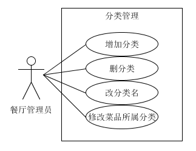
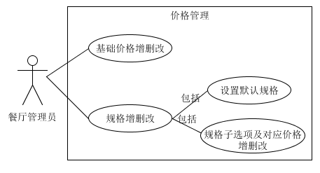

## 管理菜品

#### 菜品的管理分为以下几个需求：

1.分类管理  
*特别说明*：如果考虑“店长推荐”“新品”这种特殊分类（是有对应需求场景的），那一个菜品应该可以属于多个分类。但在目前的方案中我们决定先限制使用单分类而不考虑这样的需求。管理菜品所属分类时从已有分类中选择一个即可，若还没有分类则需要新建分类。  

		
2.价格管理  
菜品依据规格定价，每个菜品有一个基础价格，再加上规格的组合确定最终价格——每个规格选项对应一个价格的增量或者减量。卡片上会显示“最低￥ 起”（若有价格区间），菜品详情会显示一组默认规格。

3.普通信息管理  
对图、名、描述、状态、标签的增删改。

4.查找菜品  
- 按菜品搜索
- 按状态（售卖中/已下架）筛选

5.排序  
菜品和分类都需要排序以调整显示上的先后。  
考虑到PC端显示菜品卡片的列数会比手机移动端多，影响对顺序的理解，因此设计快速编辑模式，以列表的形式展现菜品（而非标准的卡片）。在快速编辑的列表中可以对菜品常用的几个信息进行编辑，以拖动的交互形式进行排序。
		
*.非功能性需求：编辑提示  
增删改时的必填，输入规范等。

#### 典型用例：
对菜品具体某个信息或属性的修改删除，以及排序查找等用例都只需要简单的一两步动作，因此不做详细的文本描述。这里仅以[新建菜品](create_a_dish.md)作为典型用例。

#### 总流程图：
