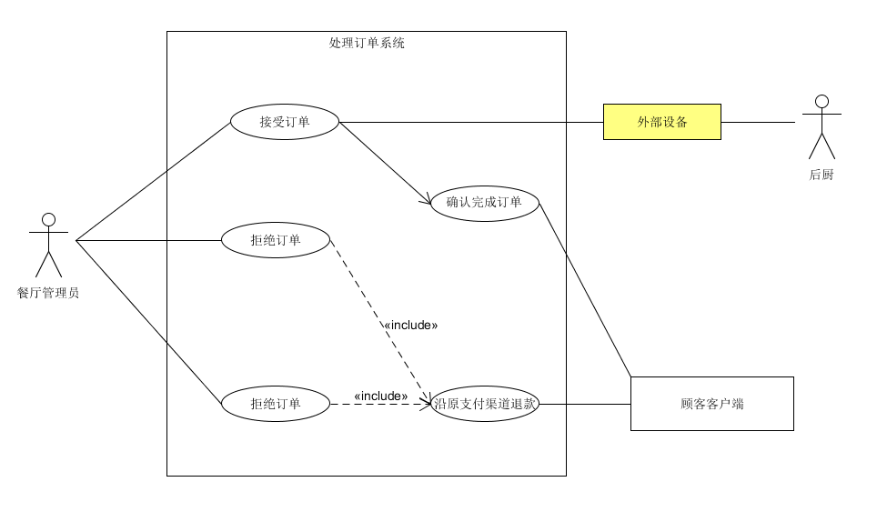

|版本|作者|用例名称|
|--|--|--|
|1.0|李晓芸|处理订单|

**用例图**

**用例名称：**

处理订单

**范围：**

web应用

**主要参与者：**

餐厅管理员

**涉众及其关注点：**
 - 顾客：希望以最快的速度收到订单处理后的反馈
 - 餐厅管理员：希望能够快速、准确无误地收到订单的详情，便捷、清晰地看到订单列表，订单的处理性非常简单，学习成本低。
 - 餐厅：希望准确地记录交易，确保记录了支付授权服务和支付票据，有一定的容错性。
 - 支付授权服务：希望接受到规范格式、金额准确的支付请求。希望准确计算对商店的应付款。

**前置条件 (Pre-Condition)：**

 - 顾客在手机客户端成功下单，并通过第三方支付通道成功支付
 - 餐厅管理员了解餐厅各项状态（如后厨材料库存）并有能力做出合理的操作

**后置条件 (Post-Condition)：**

 - 顾客收到订单状态的反馈通知
 - 将订单信息写入数据库，准确计算营业额，更新账务和库存信息。

**主成功场景 (Flow of Event)：**

 1. 餐厅客户端收到订单并通知餐厅管理员
 2. 餐厅管理员接受订单，系统将订单状态反馈给顾客的手机客户端
 3. 餐厅管理员将订单详情传递给后厨，后厨根据订单要求制作菜品
 4. 餐厅服务员将制作好的菜品端到对应顾客桌上
 5. 餐厅管理员确认完成订单
 6. 系统将订单数据写入数据库，计算营业额，更新账务和库存信息

**扩展流程：**

 <!-- a. 餐厅经理在任意时刻可进入超级管理员权限界面

   1. 输入超级管理员账号密码，系统进入超级管理员模式
   2. 超级管理员可以执行某些操作。例如，取消某一个已接受的订单并退款，更改订单金额。
   3. 系统恢复到普通用户权限 -->

 **a*. 系统在任意时刻失败

   为了支持恢复和更正账务操作，要保证所有交易的敏感状态和时间都能够从场景的任何一步中*完全恢复*

   1. 餐厅管理员重启系统，登录系统，请求恢复上次状态。
   2. 系统重建上次状态
	- 系统恢复正常，餐厅管理员查询未处理订单列表，处理未处理订单
	- 系统在恢复过程中丢失未处理的数据，餐厅管理员线下请下单未成功的顾客重新下单

 **b*. 系统在任意时刻对操作者的操作进行log记录

 1a. 餐厅管理员关闭了未处理订单窗口

   1. 餐厅管理员可以在未处理列表中再次找到相应的订单
   2. 餐厅管理员处理未处理订单

 1b. 系统通知餐厅管理员后，餐厅管理员过了5分钟仍然没有处理订单

   1. 系统再次通知餐厅管理员
   2. 餐厅管理员处理订单，系统将订单状态反馈给顾客的手机客户端

 2a. 餐厅管理员因某些原因无法接受订单

 1. 餐厅管理员写出拒绝原因
 2. 系统将订单全款沿原支付渠道退还
 3. 系统将订单状态反馈给顾客端

 2b. 顾客要求餐厅服务员取消销售交易

 1. 餐厅管理员取消该订单
 2. 系统将指定金额沿元支付渠道退还

 <!-- 3a. 餐厅管理员没有将订单信息传递给后厨

 1. 餐厅客户端提醒餐厅管理员关于

 4a. 后厨因为某些原因没法制作某菜品

 1. 后厨通知餐厅管理员该消息
 2. 餐厅管理员将该消息传递给顾客 -->

<!--  5a. 餐厅管理员没有准确把握餐厅状态，确认了未完成的订单

 1. 餐厅经理进入超级管理员模式
 2. 餐厅管理员修改订单状态为未完成订单 -->

**特殊需求：**

 - 使用分辨率较高的显示器，文本信息可见距离为1米。
 - 新订单通知消息能及时传递到餐厅管理员
 - 后厨根据订单信息制作菜品
 - 餐厅服务员准确无误地将菜品端到对应的顾客处

**发生频率：**

不断发生。

**未决问题：**