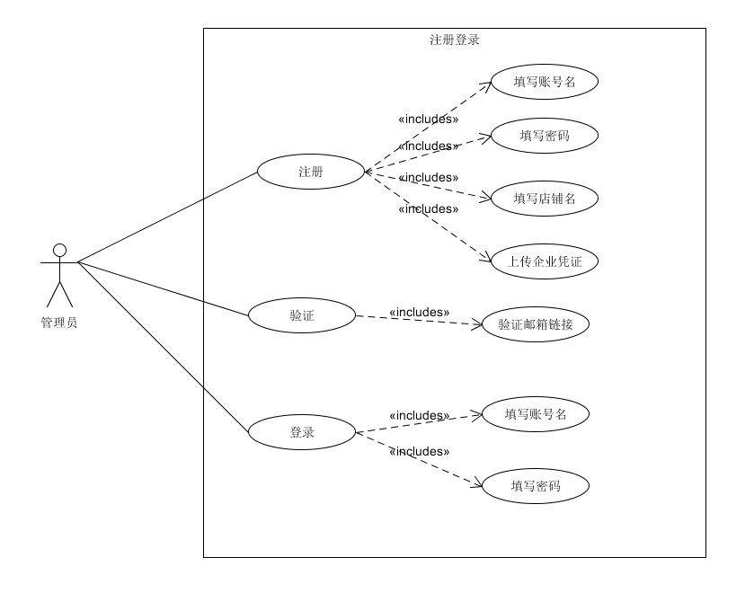
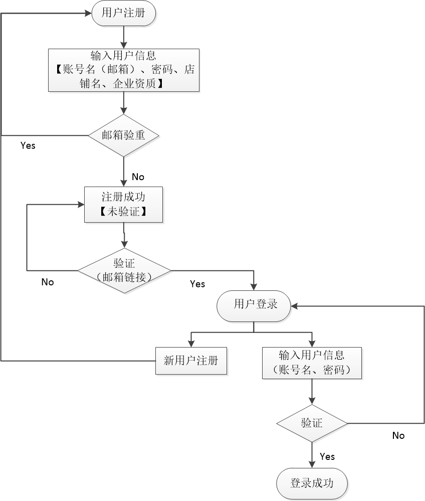

| 版本  | 日期       | 描述            | 作者   |
| ----- | ---------- | --------------- | ------ |
| 1.0.2 | 2018.05.24 | 注册登录_修改版 | 朱育佩 |

**用例图：**

##### 基本用例：

- 餐厅注册：填写账号名（邮箱）、密码、店铺名（非空），上传企业资质；
- 餐厅验证：点击邮箱链接验证信息；
- 餐厅登录：输入账号名、密码；

##### 选做用例：

- 忘记密码：邮箱验证码或链接验证【待定】，重置密码；

##### 用例名称：

​	餐厅注册与登录

##### 用例范围：

​	web网页

##### 用例级别：

​	用户目标

##### 主要参与者：

​	餐厅管理员

##### 涉众及其关注点：

​	餐厅管理员：希望能成功注册为扫码点餐系统的用户，登录系统发布餐厅的相关信息；

##### 前置条件：

​	管理员了解系统的注册与登录流程；

##### 后置条件：

​	管理员注册、登录过程输入的信息准确无误；

##### 基本流程：

- 管理员注册餐厅，填写账号名、密码和店铺名，验重通过后注册成功；
- 管理员打开邮箱，点击邮件链接，身份验证；
- 管理员登录系统，输入账号名、密码，验证通过后登录成功；

##### 特殊需求：

​	界面友好亲和，无须指导即可操作；

##### 发生频率：

​	经常发生；

##### 未决问题：

​	安全性问题；

##### 流程图：

