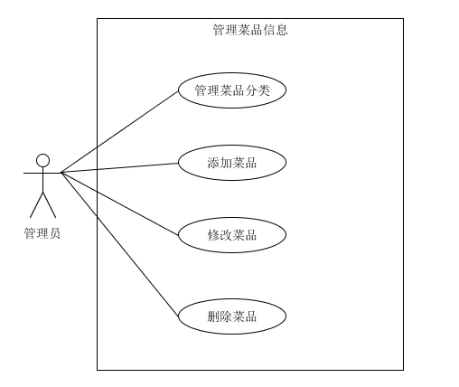

## 管理菜品

| 版本 | 日期       | 描述          | 作者   |
| ---- | ---------- | ------------- | ------ |
| 1.0  | 2018.04.11 | 管理菜品_初版 | 朱育佩 |

**用例图：**

**用例名称：** 管理餐厅菜品

**范围：** Web应用

**级别：** 用户目标

**主要参与者：** 餐厅管理员

**涉众及其关注点：**

- 管理员：希望能够准确快速地添加、删除、修改餐厅的菜品。

- 顾客：希望能够便捷地查看餐厅的所有菜品以及相应的详情信息。希望针对某些菜品能够选择合适的规格。

**前置条件：** 管理员必须正常登陆系统。

**成功保证（或后置条件）：** 管理员准确增加、删除、修改餐厅的菜品。顾客正常查看所有的菜品信息。

**主成功场景（或基本流程）：**

1. 管理员添加餐厅的菜品：
   - 选择菜品所属的类别
   - 填写菜品的信息表单，包括菜品的名称、价格、描述以及规格可选项，如辣度、甜度、配菜
   - 上传菜品的图片
   - 确认添加后，同步在数据库上增加该菜品的数据
2. 管理员修改餐厅的菜品：
   - 从菜品列表中选择目标菜品
   - 在菜品表单上，修改之前已填写的信息，或补充尚未填写的信息，如菜品的规格
   - 确认修改后，同步更新数据库上该菜品的数据
3. 管理员删除餐厅的菜品：
   - 从菜品列表中选择所要删除的菜品
   - 确认删除后，同步删除数据库上该菜品的数据

**扩展（或替代流程）：**

*a.  某时刻，菜品的剩余量为0：

1. 管理员在菜品列表中找到菜品
2. 在菜品的信息表单上，添加“已售罄”的备注
3. 更新数据库上菜品的数据，同步在顾客端上该菜品的信息中显示“已售罄”

*b.  系统在任意时刻失败：

1. 管理员重启系统，登录系统
2. 系统重建上一次的状态

1-2a. 管理员没有输入菜品的名称或价格：

1. 系统提示管理员输入菜品的名称或价格
2. 管理员输入菜品的名称或价格

1-2b. 管理员输入数据库中已存在的菜品名称：

1.  系统提示管理员已存在该菜品
2.  管理员重新输入菜品的名称，或退出当前的操作

1-2c. 管理员上传的菜品图片超过3M：

1. 系统提示管理员图片不能超过3M
2. 管理员重新选择合适的图片并上传

**特殊需求：**

- 使用分辨率较高的显示器
- 服务器的健壮性，保证菜品图片能够正常显示

**技术和数据元表：**

- 餐厅管理员通过键盘上的数字键输入菜品的价格
- 餐厅管理员需选择jpg，png，jpeg等图片格式的文件上传菜品的图片

**发生频率：** 可能会不断地发生

**未决问题：**

- 是否增加搜索菜品的功能

流程图：

