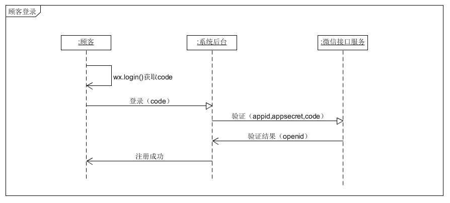

# 部分API使用说明
作者：Andie
## 餐厅注册

`POST /restaurant`

由于需要上传文件，要求使用`multipart/form-data`提交请求。餐厅注册后不会自动登录，请手动调用登录API进行登录。

### 参数说明

| 参数名   | 数据类型               | 描述     | 必需 |
| -------- | ---------------------- | -------- | ---- |
| email    | string                 | 注册邮箱 | 是   |
| password | string                 | 密码     | 是   |
| name     | string                 | 餐厅名   | 是   |
| license  | file（docx、doc、pdf） | 营业执照 | 是   |

### 返回值

| HTTP状态码 | 返回格式            | 描述       |
| ---------- | ------------------- | ---------- |
| 200        | NULL                | 成功       |
| 400        | {message: 'reason'} | 错误的请求 |

### 示例

```js
const form = new FormData();
form.append('email', info.email);
form.append('name', info.name);
form.append('password', info.password);
form.append('license', info.license, 'a.docx');
axios.post('/restaurant', form, {
  headers: form.getHeaders()
});
```

## 顾客登录与注册

`POST /customer/session`

调用API之前请使用微信小程序接口`wx.login`获取`code`，并将`code`作为登录凭证进行请求。调用此API后，如果用户没有注册，则会自动注册并登录；如果用户已经注册，则完成登录。

### 参数说明

| 参数名 | 数据类型 | 描述         | 必须 |
| ------ | -------- | ------------ | ---- |
| code   | string   | 微信登录凭证 | 是   |

### 返回值

| HTTP状态码 | 返回格式            | 描述       |
| ---------- | ------------------- | ---------- |
| 200        | NULL                | 成功       |
| 400        | {message: 'reason'} | 错误的请求 |

### 系统流程图

注册流程图


登录流程图

 

### 示例

 ```js
const { code } = await wx.login();
axios.post('/customer/session', { code });
 ```

## 发送验证邮件

`POST /restaurant/emailConfirm`

使用这个API之前，请先保证餐厅账号已登录。调用后，系统会向餐厅注册的邮箱发送一封带有认证链接的邮件。

### 参数说明

没有参数

### 返回值

| HTTP状态码 | 返回格式            | 描述       |
| ---------- | ------------------- | ---------- |
| 200        | NULL                | 成功       |
| 400        | {message: 'reason'} | 错误的请求 |

### 示例

```js
axios.post('/restaurant/emailConfirm')
```

## 验证邮箱

`GET /restaurant/emailConfirm`

通过点击认证链接调用这个API。

### 参数说明

| 参数名 | 数据类型 | 描述               | 必须 |
| ------ | -------- | ------------------ | ---- |
| cipher | string   | 后端自动生成的密文 | 是   |
| url    | string   | 成功之后的回调url  | 否   |

其中第二个参数`url`：

- 如果提供，则在成功之后，会重定向到指定url；失败则直接显示失败原因
- 如果不提供，成功和失败都直接显示

### 返回值

| HTTP状态码 | 返回格式            | 描述       |
| ---------- | ------------------- | ---------- |
| 200        | NULL                | 成功       |
| 400        | {message: 'reason'} | 错误的请求 |

