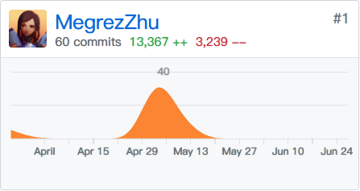
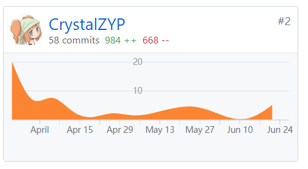
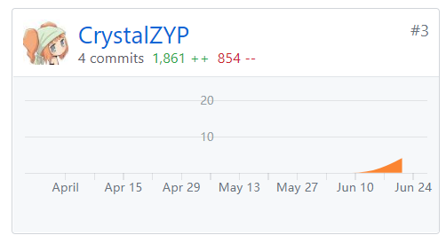
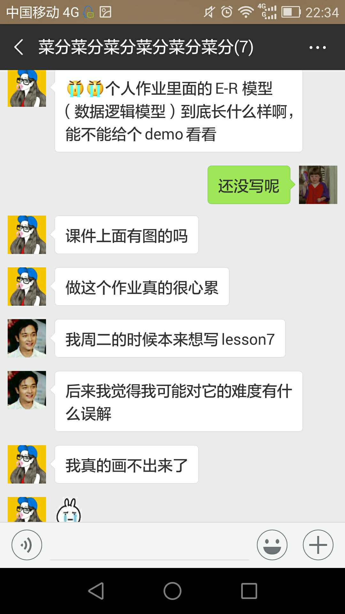
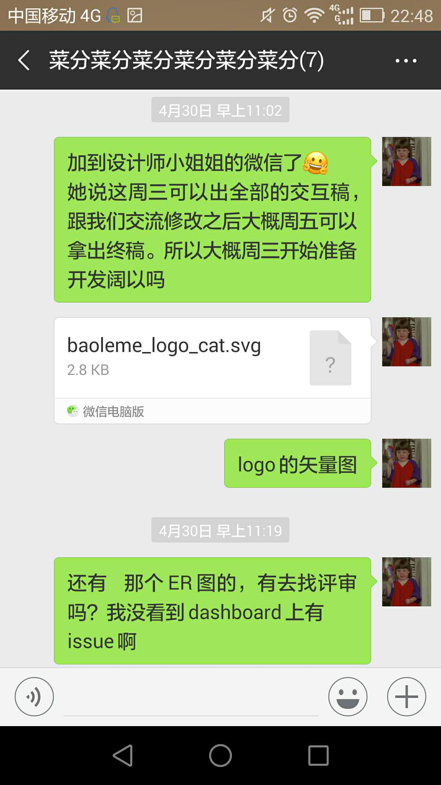
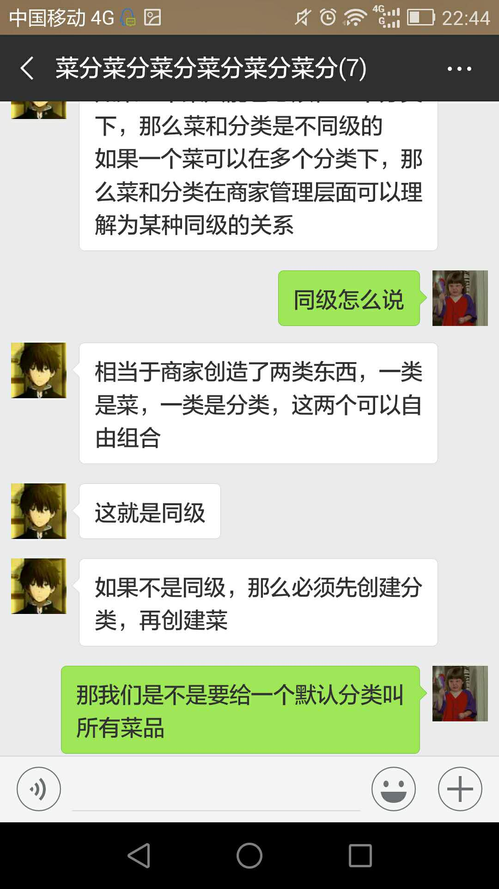
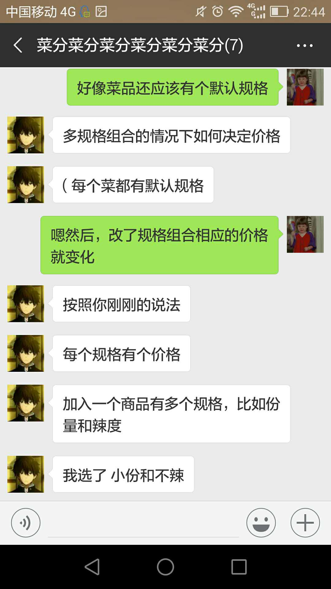

# Final Report

## 团队成员自我总结

`15331432 @zhoumumu`

于我，算是过了把PM的瘾，用软件工程的方法亲身实践项目管理——虽然与真实的产品生产过程和环境还有一定差距。
我觉得自己做的好的地方大概保证了项目进度不掉线吧（事实上还挺快）。不会说期末了开始爆肝拼命赶，而是每次团队作业保质保量去完成，每周操心一下该有什么进度要面对什么问题。啊但是，没做好的地方在于，后来迭代战线拉得太长，我自己都慢慢懈怠下来了。团队里面的职责划分很明确，特别是开发三位大佬挑起了大梁，一个人负责一个端也因此几乎没有沟通问题。后端的API文档还有线下面基都高效地传达了设计意图。
我在其中好像也没干啥又好像干了很多杂七杂八的，我大概是在不停地寻找解决方案吧，满足需求的设计方案、完成作业的方案。作为PM跟开发大佬们的相处也很融洽（求楼下程序员哥哥不黑），毕竟产品经理管理的只是项目，跟人的话还是可以站到统一阵线找到共同利益的。

`15331365 @yxlshk`

本次的课程学习，让我了解了整个软件开发生命周期，特别是了解了“分析”和“设计”，以及后期的“测试”。过去的学习更侧重于学习“开发”和计算机的一些基础的理论的知识，而系分课程让我了解了开发一个软件绝不仅仅是打代码。

前期的分析设计，各种文档的编写、画各种UML图，让我知道一个软件的每一个细节的设计都是需要考虑很多东西的，学会了如何站在用户的角度，来决定一个需求是要保留还是删除，以及要以提升用户体验为目标来决定需求。

同时，此次的项目分工也是大学以来最明确最贴近真正项目开发的，也让我提前感受了一下真正的项目管理合作。

而开发方面，我参与了“测试”的代码编写，将《软件测试》课程的知识应用进来，体验了一个测试工程师的工作。

总之，本次的课程学习，特别是课程项目这一块，我的收货还是很大的。

特别鸣谢：PM大大，web端、小程序端、后端三位大佬，以及一起为需求、测试奋战两位小伙伴。

`15331436 @MegrezZhu`

饱了么项目是我学习打代码以来做的最正式的一次项目，不管是从初期的需求讨论、还是期间的每次例会然后讨论出当次的成果，又或者是到后期开发时按着设计文档一点点做出成品来，都让人有种很踏实的感觉。

当然还是因为队友很靠谱，感谢PM一直催我进度，感谢后端洛阳大佬在任何时候承接的增加API的需求，感谢商家端李主任任劳任怨，感谢在这条总结上面的队友，感谢在这条总结下面的其他队友。

`15331274 @办公室李主任`

这个课程大作业是大家大学以来课内做的比较完整的项目。面对了很多令人头疼的文档，但也感受到了做这些专业文档的好处。

负责前端之商家端的开发，踩了不少新坑，也一一填满了。

感谢pm、测试的三位大佬。跟另两位开发大佬的合作也学到了很多东西。

特别鸣谢：帮忙画设计稿的传设院的师姐。

`15331169 @humanlee1011`

本次课程大作业，不仅运用到了系统分析设计的知识，也可以说是本科学习阶段成果的一个基本检验。而且团队开发让整个项目的量级变大，更像是一个真正的软件了。在完成这个项目时，我们不仅仅要考虑到如何优美的编写代码，也要考虑到如何合理地分析设计，这对于我未来完成其他项目时会有很大的帮助。

在这个项目里，我主要参与了分析设计部分的以及测试部分的工作，能够将两门课程的理论知识运用其中，收获颇丰。

在这里也要非常感谢尽职尽责的PM，开发端的三位大佬，以及两位一起写文档、一起测试的大佬。

`15331446 @CrystalZYP`

自我感觉，Baoleme是大学三年以来做得最完整最快乐的一次课程项目，我从中学到不少实操性知识，尤其是对于产品的需求分析和设计、测试有所了解。每次开线下例会或是线上讨论，团队成员们的思维碰撞促使了项目一步步的顺利进行，让使我学到很多思考问题、解决问题的技巧。

我负责的工作主要是参与需求分析、设计以及部分测试，将这学期的系分课和软测课所学的理论知识应用到实际的项目中。

很幸运能与这么几个做事认真，吹水有趣的人一起完成项目，也感谢传设院某个不知名的画设计稿小姐姐~~

## PSP-2.1统计表

`PM：@zhoumumu 15331432`

| PSP阶段                    | 耗时(h) |
| -------------------------- | ------- |
| 计划                       | 16      |
| ·  估计任务时间            | 4       |
| 开发                       | 58      |
| ·  分析需求                | 24      |
| ·  生成设计文档            | 18      |
| ·  设计复审                | 8       |
| ·  代码规范                | 0       |
| ·  具体设计                | 8       |
| ·  具体编码                | 0       |
| ·  代码复审                | 0       |
| ·  测试                    | 0       |
| 报告                       | 1       |
| ·测试报告                  | 0       |
| ·计算工作量                | 0.2     |
| 事后总结，提出过程改进计划 | 8       |
| **合计**                   | 83      |

`15331365 @yxlshk`

| PSP阶段                    | 耗时(h) |
| -------------------------- | ------- |
| 计划                       | 4       |
| ·  估计任务时间            | 4       |
| 开发                       | 56      |
| ·  分析需求                | 16      |
| ·  生成设计文档            | 16      |
| ·  设计复审                | 0       |
| ·  代码规范                | 0       |
| ·  具体设计                | 8       |
| ·  具体编码                | 0       |
| ·  代码复审                | 0       |
| ·  测试                    | 24      |
| 报告                       | 4       |
| ·测试报告                  | 4       |
| ·计算工作量                | 0       |
| 事后总结，提出过程改进计划 | 4       |
| **合计**                   | 64      |

`15331274 @办公室李主任`

| PSP阶段                    | 耗时(h) |
| -------------------------- | ------- |
| 计划                       | 2       |
| ·  估计任务时间            | 2       |
| 开发                       | 127     |
| ·  分析需求                | 16      |
| ·  生成设计文档            | 16      |
| ·  设计复审                | 0       |
| ·  代码规范                | 1       |
| ·  具体设计                | 4       |
| ·  具体编码                | 90      |
| ·  代码复审                | 0       |
| ·  测试                    | 0       |
| 报告                       | 2       |
| ·测试报告                  | 0       |
| ·计算工作量                | 2       |
| 事后总结，提出过程改进计划 | 2       |
| **合计**                   | 133     |

`15331436 @MegrezZhu`

| PSP阶段                    | 耗时(h) |
| -------------------------- | ------- |
| 计划                       | 8       |
| ·  估计任务时间            | 8       |
| 开发                       | 110     |
| ·  分析需求                | 12      |
| ·  生成设计文档            | 20      |
| ·  设计复审                | 4       |
| ·  代码规范                | 4       |
| ·  具体设计                | 0       |
| ·  具体编码                | 64      |
| ·  代码复审                | 4       |
| ·  测试                    | 2       |
| 报告                       | 0       |
| ·测试报告                  | 0       |
| ·计算工作量                | 0       |
| 事后总结，提出过程改进计划 | 4       |
| **合计**                   | 122     |

`15331169 @humanlee1011`

| PSP阶段                    | 耗时(h) |
| -------------------------- | ------- |
| 计划                       | 2       |
| ·  估计任务时间            | 2       |
| 开发                       | 60     |
| ·  分析需求                | 10      |
| ·  生成设计文档            | 20      |
| ·  设计复审                | 0       |
| ·  代码规范                | 0       |
| ·  具体设计                | 8       |
| ·  具体编码                | 0      |
| ·  代码复审                | 0       |
| ·  测试                    | 22       |
| 报告                       | 2       |
| ·测试报告                  | 2       |
| ·计算工作量                | 0       |
| 事后总结，提出过程改进计划 | 2       |
| **合计**                   | 66     |

`15331446 @CrystalZYP`

| PSP阶段                    | 耗时（h) |
| -------------------------- | -------- |
| 计划                       | 2        |
| ·  估计任务时间            | 2        |
| 开发                       | 60       |
| ·  分析需求                | 10       |
| ·  生成设计文档            | 20       |
| ·  设计复审                | 0        |
| ·  代码规范                | 0        |
| ·  具体设计                | 8        |
| ·  具体编码                | 0        |
| ·  代码复审                | 2        |
| ·  测试                    | 20       |
| 报告                       | 4        |
| ·测试报告                  | 4        |
| ·计算工作量                | 0        |
| 事后总结，提出过程改进计划 | 2        |
| **合计**                   | 68       |

## Git统计报告

* @MegrezZhu
  * 
  * 

* @CrystalZYP
  * Dashboard
  
  
  * Server
  
   

## 劳苦清单

| 成员          | 一句话                                                       |
| :------------ | ------------------------------------------------------------ |
| @zhoumumu     | **Decide** when who how —— 一点都不辛苦啊~ Orz               |
| @yxlshk       | 撰写文档、画各种图、测试——体验了项目开发的多个阶段不同工作。 |
| @办公室李主任 | 学画图、写文档，以及前端的踩坑补坑                           |
| @MegrezZhu    | 发了很多表情包，打了很多场球，吹了很多的水并顺便写了小程序、抓了些数据 |
| @humanlee1011 | 需求分析，软件测试——确实是全新体验                           |
| @CrystalZYP | 写了点文档，画了点图，做了点测试                           |

## 我们的日常

刷一下我们的聊天记录——这个群都文(t)明(m)是些什么人？？？

日常流着泪写作业

PM日常催命

日常较真

 

日常商业互吹和逗逼

  
