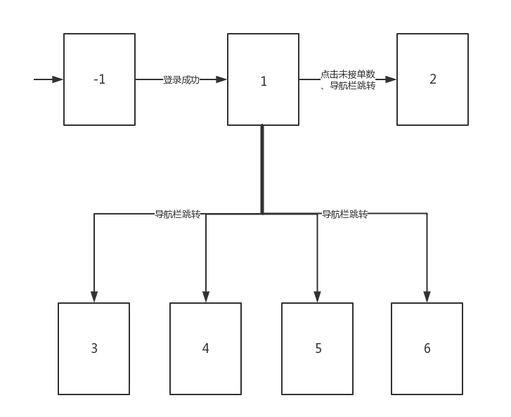
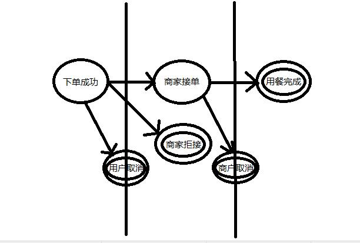

# PC端页面流与数据约定

## -1.登录/注册界面
略

## 0.侧边导航栏
包含：分级菜单

  - 分级菜单：概览、营业（订单、历史）、管理（菜品、二维码、商户）

***注：**
  - 导航栏一直都在，每个页面中都显示

## 1.概览页面
包含：商家基本信息、未接单数、已结单数、今日订单总数
  
  - 商家信息：店名、简介、Logo、联系电话

## 2.订单处理页面
包含：正在进行中的订单列表

  - 列表项：订单号、金额、餐桌号、当前状态形成时间（时间点）、当前状态
  - 状态：新订单、已接单
  - 订单操作：接单、拒接、取消、完成

***注：**
  - 按新订单到来时间顺序分页排列
  - 订单的生命周期如下图，主要分为三个阶段；每个圆圈代表一个订单状态，双圈为终止态
    
  - 在本页面被操作转到终止态的订单都将从列表中移除，与历史订单页面不同，停留在本页面的订单只会有新订单和已接单两种状态

## 3. 历史订单页面
包含：每笔历史订单列表、筛选操作区

  - 列表项：订单号、金额、餐桌号、最后一个状态形成时间（时间点）、最后一个状态
  - 列表项向下展开：每一个状态、对应时间（日期+时间点）
  - 筛选条件：订单号、时间（日期+时间点）、状态
  - 筛选结果为空的提示：“没有符合条件的订单”（等等）

***注：**
  - 按新订单到来时间顺序分页排列
  - 本页面订单列表包含了上一个页面的订单，因此最后一个状态就是指时间上最晚的那个状态，并非一定是终态

## 4.生成了二维码的页面
包含：桌数输入框、二维码图片构成的网格、导出键

***注：**
  - 刚进来这个页面是只有输入框的，输入了桌数以后再生成二维码，然后才能导出

## 5.菜品管理页面
包含：分类（列表/..）、菜品(列表/..)
  - 菜品信息：图、名、价、标签、简介、规格（可选）
  - 规格：规格名、选项
  - 分类：分类名
  - 操作：增、删、改

***注：**
  - 可选是指并非菜品必要信息
  - 可以仿照手机菜品展示的设计

## 6.商家信息页面
包含：账户信息、商家实体信息

  - 账户信息：用户名、密码
  - 商家实体信息：店名、简介、Logo、联系电话
  - 操作：除了用户名，其他都可修改