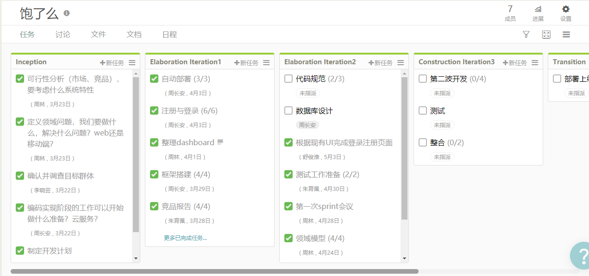
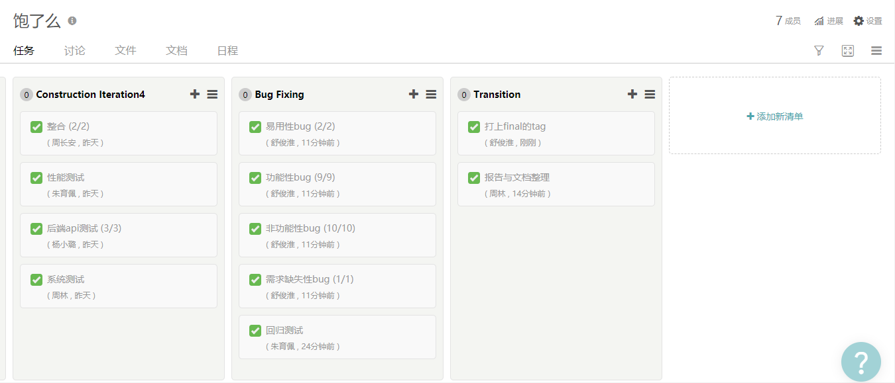

# About

Records of Baoleme development progress.

## 1、About Project

### 1）Introduction

Baoleme是一个扫码点餐结算系统，我们本着让餐饮企业与顾客双赢的理念，专注于实现顾客自助点餐结算的功能，让整个用餐过程流畅快捷、安全可靠。我们将提供最好的服务和最优的用户体验，在同类产品中独树一帜，脱颖而出。

### 2）Team Division

- 项目经理: 周林
- 客户经理：李晓芸、朱育佩
- 架构师：朱楚
- 开发工程师:
  - 前端：朱楚、舒俊淮、杨小璐
  - 后端：周长安
- 测试：李晓芸、朱育佩、舒俊淮、杨小璐
- DevOps：周长安

### 3）Documentation

- 需求文档
- API接口文档
- …（待补充）

## 2、Iterations

### Inception

**week 1(3/22/2018)**

Kickoff meeting in Thursday 

Artifacts:

- 项目策划书初版：从高层面说明愿景、商业模式、项目可行性
- 需求文档初稿
- 初步的用例模型：文档+用例图（UML）+流程图
- 前端技术调研及选型
- 后端选型
- 下阶段开发计划

### Iteration 1

**week2（3/29/2018）**

iteration1 meeting in Thursday

Artifacts:

- 规范了版本控制
- 明确了支付形式
- Backlog
- 明确产品定位
- 初步完成登录注册功能
  - 后端数据库的设计、API的设计
  - 小程序端的客户登录
  - PC端的商家注册以及登录
- （其他成果待补充）

### Iteration 2

- mainly elaboration and design
- detail in tower
- artifacts as homework lessonX

### Iteration 3

**week9-week10（before 5/13/2018）**

sprint meeting in 2018/4/28

Artifacts:

- 第二轮开发Backlog
- 所有UI设计
- 完成backlog确定的四个功能点

### Iteration 4

**week17-week18（7/7/2018）**

The development of Iteration 3 last long, so we made a review meeting in 2018/5/25, and carried out integration and testing later.

Artifacts:

- 所有实现源码
- 测试报告

### Iteration 5

**7/7/2018 - 7/8/2018**

Bug fixing and Transition

Atifacts:

- 可交付制品
- 报告和文档

