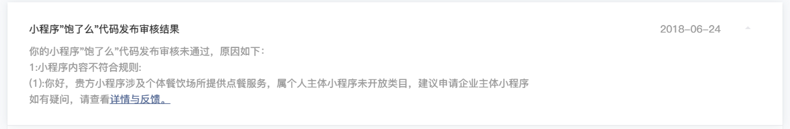
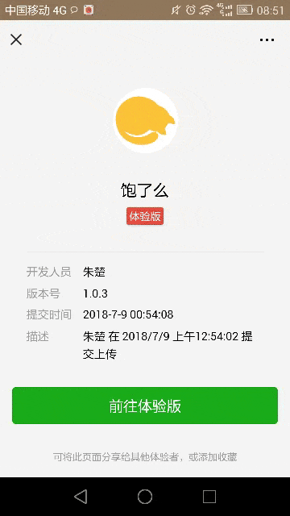
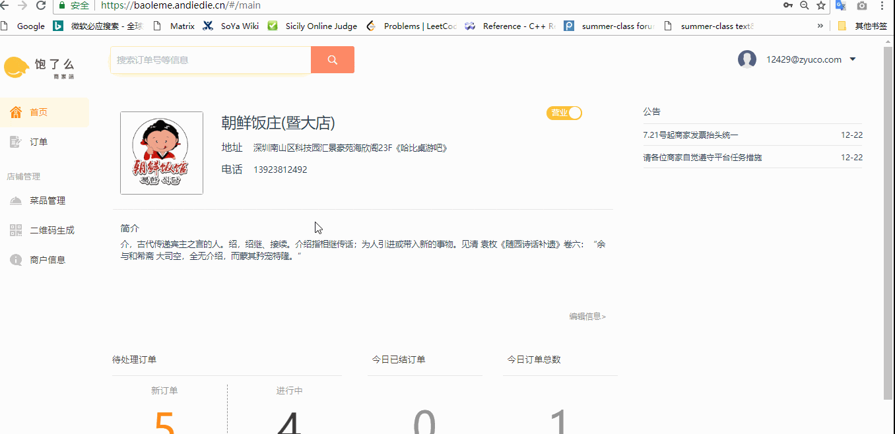

**说明：本项目无需用户安装部署。**

- 商家端是web应用，服务器已经部署好，在浏览器打开https://baoleme.andiedie.cn 即用。
- 客户端是小程序，但因属未开放类目未通过微信上线审核，因此只有经开发者授权的微信账号主体才可体验。如有需要，请联系我：1696837023（QQ）

---

进入小程序，扫描准备好的商家二维码，可选餐点单。

登录商家端，可以看到新收到的订单，并进行接单和取消等订单操作。

