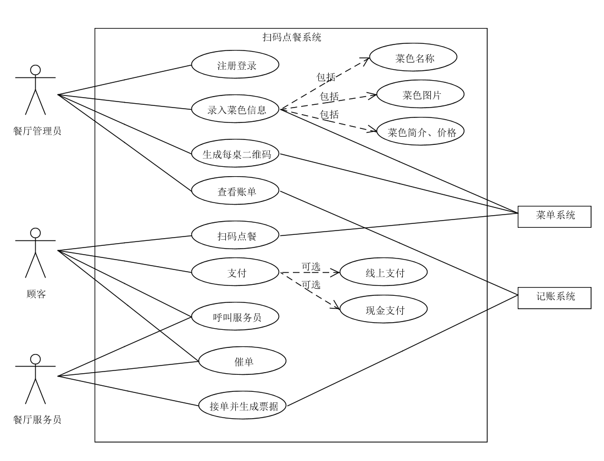
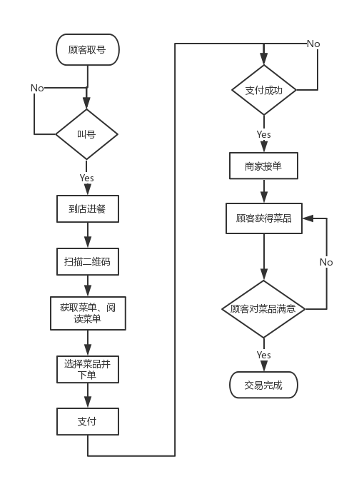

**用例图**

**流程图**
 - 顾客使用流程图
 

 - 商家使用流程图
  

**基本用例：**
 -  餐厅注册登录：一个餐厅作为一个店铺用户注册并登录系统。
 - 餐厅录入信息：餐厅上传餐厅信息（餐厅简介、广告语）、食品信息（价格、数量、介绍、图片）。
 - 生成二维码：餐厅管理员用系统为每张餐桌生成二维码。
 - 顾客点餐：顾客进入餐厅，用手机扫描桌上二维码，系统显示点餐菜单。顾客选择餐饮种类以及数量，添加备注，点击结算、支付。
 - 餐厅接单：餐厅收到点餐信息（桌号、餐饮类型与数量、备注），以及用户的付款，根据信息打印票据。
 - 餐厅管理：查询近期账单（各菜色的销量、收入）。
 
**扩展用例：**
 - 现金支付：如果顾客有现金支付的需求，可以点击“现金支付”按钮，同时，餐厅端服务员会有一个“确认现金已支付”按钮，顾客用现金支付完后，服务员点击“确认现金已支付”，完成交易，打印票据。
 - 呼叫服务员：顾客在点餐界面有个呼叫服务员按钮，一按餐厅端的服务员便收到信息（桌号、时间）。
 - 催单：点餐后过了好久都没上菜，顾客可以在点餐界面点击催单按钮，餐厅端收到催单信息（桌号、时间）。
 
**选做用例：**
 - 多人点单：同一桌的多个顾客同时用手机扫描二维码，系统显示点餐菜单，顾客可以同时点餐，并将点餐数据统一到一份点餐信息上，发送到餐厅端。
 - 多人支付：支持AA支付法，每个顾客支付各自的部分。

**用例名称：** 扫码点餐

**范围：** 小程序

**级别：** 用户目标

**主要参与者：** 餐厅服务员

**涉众及其关注点：**
 - 餐厅服务员：希望能够准确、快速地得到点餐信息。
 - 厨师：得到准确的点餐信息（食品的种类、数量、要求）。
 - 顾客：希望能方便快速完成点餐服务，快点得到餐厅服务。并希望能清晰准确地看到各 - 种食物的价格和介绍。
 - 餐厅：希望能准确记录交易过程，提升顾客体验，更快服务更多顾客，制造更多的营业额，准确地看到近期营业信息。
 
**前置条件：**
服务员必须经过确认和认证。

**成功保证（或后置条件）：**
信息传递准确，支付无误，生成票据，记录营业信息。

**主成功场景（或基本流程）：**
- 餐厅注册并登录系统
- 餐厅提前上传食品信息（价格、数量、介绍、图片）。
- 餐厅为每张桌子生成二维码
- 顾客扫描二维码显示出菜单
- 顾客选择食品种类数量，写好备注
- 顾客线上支付
- 服务员得到点餐信息和付款，生成票据
- 餐厅查看近期营业信息

**扩展（或替代流程）：**
- 现金支付：在主成功场景的顾客线上支付阶段，顾客若需要现金支付，可以选择“现金支付”按钮，顾客用现金支付完后，服务员点击“确认现金已支付”，完成交易，打印票据。
- 呼叫服务员：顾客在点餐界面有个呼叫服务员按钮，一按餐厅端的服务员便收到信息（桌号、时间）。
- 催单：点餐后过了好久都没上菜，顾客可以在点餐界面点击催单按钮，餐厅端收到催单信息（桌号、时间）。
- 多人点单：同一桌的多个顾客同时用手机扫描二维码，系统显示点餐菜单，顾客可以同时点餐，并将点餐数据统一到一份点餐信息上，发送到餐厅端。
- 多人支付：支持AA支付法，每个顾客支付各自的部分。

**特殊需求：**
- 菜单图文并茂，富有吸引力
- 操作流畅，页面赏心悦目

**技术和数据元表：**
每个餐桌有其独有的二维码。

**发生频率：**
可能会不断发生。

**未决问题：**
- 故障恢复问题
- 线上支付功能
