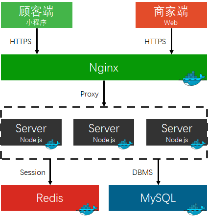
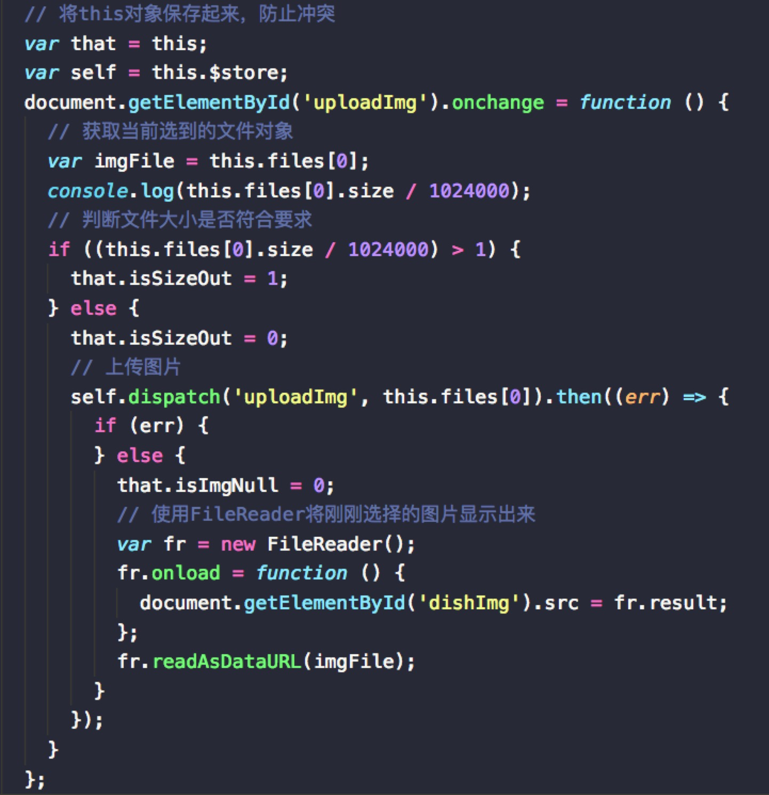
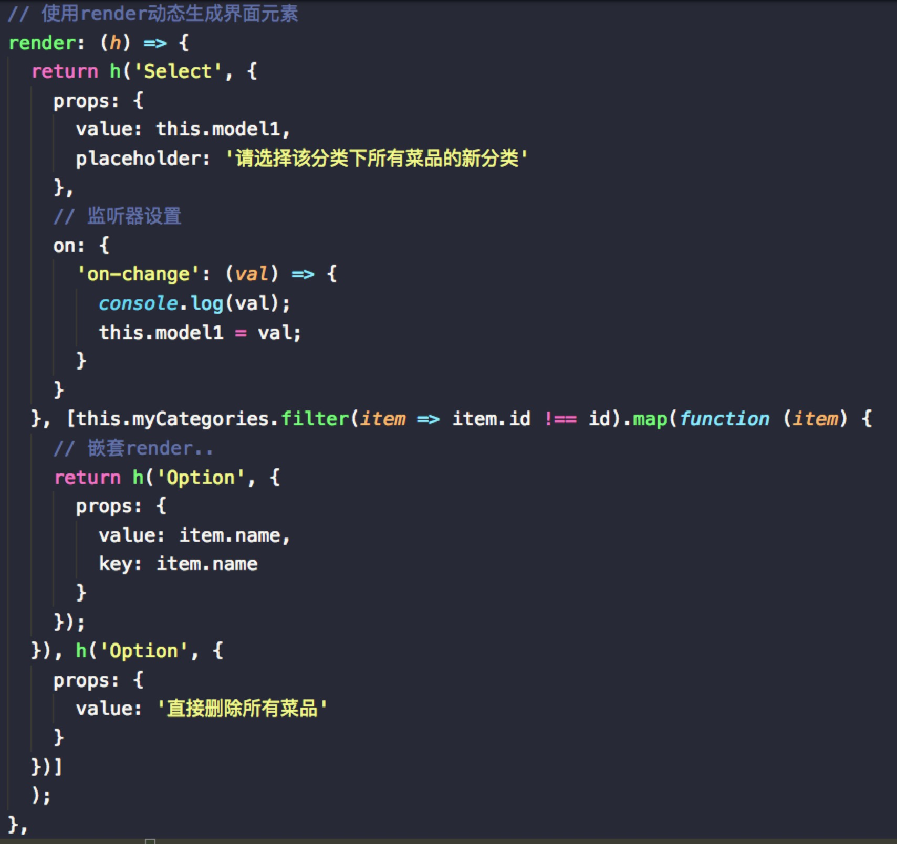
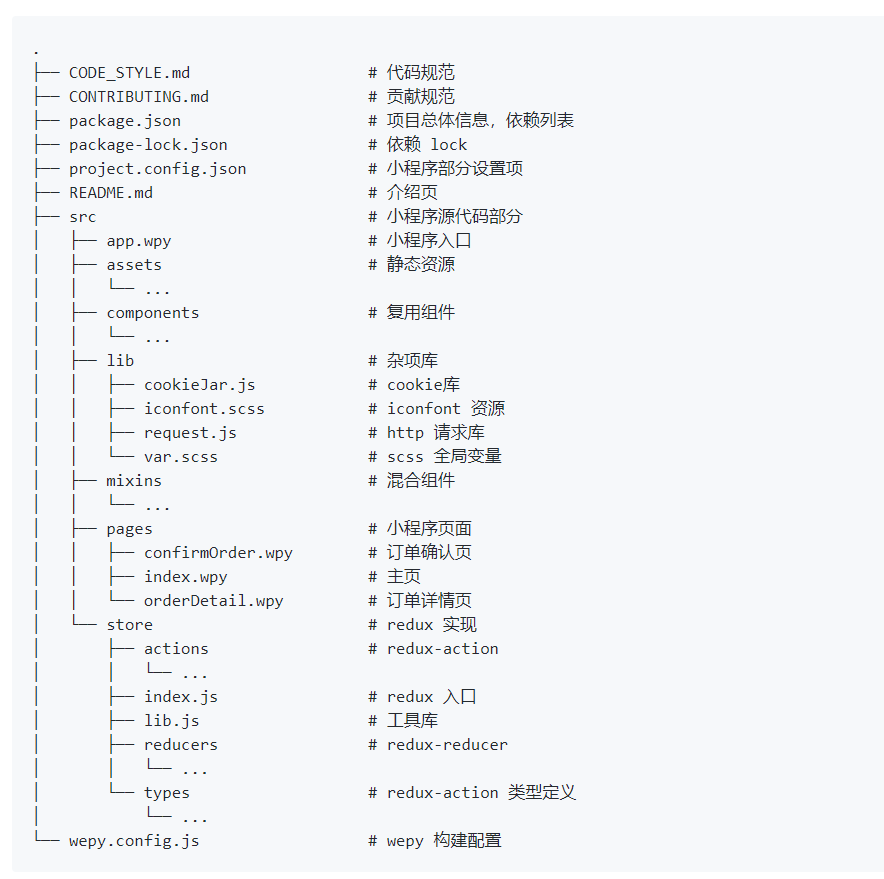

# 1. 设计

## 1.1. 技术选型理由

### 1.1.1. 前端

#### ① 形式

##### 候选

一共有三种候选：App、Web与小程序

- App

  App在移动端上能得到最好的用户体验，但对新用户来说安装一个新App的成本较高。

  而且，对于本项目扫码即用的需求来说，如果使用App提供服务，则用户需要经过“扫码 - 打开Safari - 唤出App”（iOS）或者“打开App - 扫码”这样的步骤，稍显繁琐。

- Web

  相比App来说，Web更加轻量，不需要用户安装额外的应用。但由于浏览器厂家、版本等不同带来的兼容性问题为开发带来了难度，而且通常Web端的流畅度体验一般不佳。

- 小程序

  小程序是基于微信的一种服务形式，体验比起Web更接近原生应用。而且基于用户基本都安装有、且已打开微信的场景，省去了用户安装App的时间成本，更加方便。

##### 最终选择

基于前面三种候选的比较，我们最终为消费者端以及商家端决定了选型。

- 顾客端

  作为最终的用户，我们希望用户的使用能尽可能的方便，而且用户体验在这一端也最重要，因此经过考量我们选择使用小程序作为顾客端的形式。

- 商家端

  商家作为我们的中间用户，对于产品的便利性需求不高，对产品的功能完整性有较高的需求，因此我们选择了Web端（PC端）作为商家端。


#### ② 框架选择

##### 顾客端

- 原生小程序开发

  即不使用额外框架，只使用微信提供的小程序框架（WXML + WXSS + JS）进行开发。这样最贴近原生开发、没有引入额外框架带来的潜在出错几率。

  缺点是对于每个页面，都需要三个文件（WXML +WXSS + JS），比较繁琐。

- WePY

  WePY是腾讯官方开发的小程序框架，使用接近于Vue的风格，能够进行组件化、单文件开发。同时集成了各种polyfill、CSS预处理等实用功能。

选择使用WePY进行开发。

##### 商家端

- JQuery + Bootstrap

  非SPA应用，需要各种页面重载，用户体验不佳。

- Angular

  MVC模式，有依赖注入等优势，但脏值检查性能较差。

- Vue

  MVVM模式，组件化开发，通过setter与getter以及VDOM提供了较好的性能。而且其文档更完整。

- React

  React + Redux的搭配加上不可变的数据减少了出bug的可行性，但jsx里代码与HTML耦合程度较高。

基于开发难度与社区活力，我们选择Vue进行SPA应用开发。


### 1.1.2. 后端

#### ① 语言选择

##### 候选

- C/C++

  C 语言虽然是非常贴近操作系统的语言，能和操作系统 API 很好的交互，但是 C 语言并没有现代化工程开发所需要的诸如面向对象等重要功能。

  C++ 具有现代化工程开发所需要的各种功能，同时也像C一样能方便的与操作系统 API 交互，但是它同样有缺点：

  - 缺乏字符串处理，Web 开发最主要的就是字符串的处理，所有的一切几乎都要和字符串打交道。但是 C++ 只有 std::string 标准库提供的字符串类，缺乏方便的 UTF-8 和正则表达式匹配支持等。
  - 缺乏 Web 标准的支持，即语言层面上缺乏对 HTTP 协议的支持。Web 是基于 HTTP 协议和 TCP 协议产生的。而 C++ 极度缺乏这方面的支持，只能自己手工处理 Socket 通信。
  - 缺乏 HTTP 框架和业务代码之间的交互标准，框架就算完成了 HTTP 通信部分，也没有一个标准规定框架如何和业务代码交互。不过，实际上 C++ 框架是实现自己的交互流程。但是缺乏规范则是框架稀少的原因。

- Java

  Java 的效率相对于 C/C++ 这种手动管理内存的语言来说是低的，哪怕使用了引用计数，C/C++ 在性能上也远超过 Java。但是 Java 相对于其他脚本语言来说优势非常明显：

  - 强类型、编译型语言，这点就使得 Java 在效率远超动态类型语言，而且在编译时就能发现 bug，不需要等到运行时再去调试，现在的很多 IDE 也能做静态语言分析，不需要编译就能发现语法错误，这就能提升效率。
  - Java SE 规范，这让 Java 即能像 C/C++ 一样贴近操作系统，又自由处理网络相关、IO 相关的内容，功能很强大。
  - Java EE 规范，完善的规范使得 Java 后端发展有了很好的规范基础。统一的环境、规范让框架和业务代码有了交互的标准。
  - Java 有着最完善的生态链，无论是框架还是编译工具链，模块系统做的非常棒，现代工程所需的各种设计模式都有着很好的实践。除了 Java 以外，JVM 上面还有着更多的语言可以选择。

  缺点：

  - 开发效率相对较低。
  - 虽然上手开发相对容易，但真正理解框架底层的运行原理相对较难，需要大量的学习和经验。
  - Java 并没有在第一时间引入新颖的技术和语言特性。
  - 本身的规范和不够灵活也导致了代码本身很难优化，好的代码和差的代码在一套规则的束缚下实际上性能并没有多少差距，更多的优化被交给了 JVM。

- PHP

  PHP 作为一门脚本语言，本身运行效率确实不是很高，但是在 PHP7 平台上，已经算是脚本语言中比较高的了，而且在现有的硬件平台上，PHP 本身的效率基本不会成为瓶颈。它作为一门脚本语言也有着很多优势：

  - 天生的模板语言，不需要学习其他的模板语言，提升了开发效率，也提升了运行效率。
  - 上手容易，生态链也很不错，LAMP、LNMP 这样部署的技术非常普及，学习成本较低。

  缺点：

  - 解释型语言，运行效率低，且无法常驻内存。
  - 缺乏好用的包管理和命名空间，也缺乏好用的模块系统 。

- Node.js

  Node.js 作为目前比较火热的语言，确实有它的独到之处，这里先列举它的优点：

  - 事件循环 + 异步 IO，使 Node.js 在IO性能上有极其优秀的表现。
  - JavaScript 易上手，且有着活跃的社区和很多的第三方库。
  - 使用 NPM 这一优秀的包管理工具。
  - 前端使用 JavaScript，Node.js 能做到全栈开发。

  缺点：

  - 默认单进程，单线程，只支持单核CPU，不能充分的利用多核CPU服务器资源。
  - 动态语言，可靠性低，调试困难。许多错误只有在运行时才能发现。

- Python

  Python 入门简单，并且经过长期发展，各种 Web 框架环境非常成熟，主要的一些框架，其接口和用法相对较为稳定，资料也非常丰富。

  优点：

  - 学习简单，能快速进行开发构建 Web 应用。
  - 拥有丰富的标准库和第三方库。
  - 在WEB方面有多种成熟的框架。

  缺点：

  - 作为解释型语言，运行速度较慢，且无法有效利用多线程。
  - 包管理工具和语言升级带来的混乱，且部署工具生态混乱。
  - 缺少有效的性能分析和调试工具。

- Go

  Golang 的设计理念很明确，就是将动态类型语言的编程容易度和静态类型语言的安全效率结合起来。

  优点：

  - 部署简单，Go 编译生成的可执行文件无需担心包和库的依赖关系。
  - 并发性能好，即使是单个Go应用也能有效利用多个 CPU 核心。
  - 良好的语言设计，且自带完善的工具链。
  - 性价比高，在编译型语言的运行性能和动态语言的开发效率间平衡的很好。

  缺点:

  - import 的包不支持自定义版本，项目容易因为包的升级而不可用。
  - 垃圾回收机制仍存在一些问题。
  - 暂时缺乏比较完善的框架。


##### 考虑要素

- 技术

  选型在技术层面，主要考虑语言的可用框架、工具、设计模式、开发模式等部分。主要有两个原则：取长避短、关注发展前景。

  从上面的提名语言中可以看出，C/C++ 在框架和工具上考虑，适不适合作为本次后端的开发语言。

  Go 虽然有着良好的性能和完善的工具链，且有着良好的发展前景，但其语言本身还存在一个致命的缺陷 —— GC。目前 Go 的垃圾回收还无法很好的解决内存碎片和对象过多导致的性能问题，且 Go 在 Web 开发框架方面，并没有非常好的选择。

- 业务

  结合点餐这个业务需求，我们可以发现这个场景主要特点是高并发。在用餐时间，短时间内会面临大量的请求，因此 IO 性能成为我们考虑的主要方向。

  从这一点出发，Java 表现中庸，PHP 和 Python 显然不能胜任这个重任，Go 具有良好的并发性能。Node.js 在使用单核资源的情况下也能够有极佳的 IO 性能，且可以通过 Node.js 的 Cluster 特性利用服务器的多核资源。

- 开发人员

  从团队技术栈的角度出发，团队成员比较熟悉的开发语言是 Java 和 Node.js。


##### 最终选择

基于上述三个因素的考量，最终我们选择 Node.js 作为后端编程语言。

- Node.js 社区活跃，工具链完整，开发敏捷，对JSON支持良好符合技术相关要。

- Node.js 高 IO 性能的特性很好的符合了我们的业务需求。

- Node.js 学习成本较低，且开发人员相对熟悉，能够快速进行上手开发。


#### ② 框架选择

Node.js 流行的Web开发框架：

- Express：保持最低程度规模的灵活 Node.js Web 应用程序框架，基于中间件为 Web 服务提供各类功能。

- Koa：koa 是由 Express 原班人马打造的，致力于成为一个更小、更富有表现力、更健壮的 Web 框架。 使用 koa 编写 web 应用，通过组合不同的 generator，可以免除重复繁琐的回调函数嵌套， 并极大地提升错误处理的效率。koa 不在内核方法中绑定任何中间件， 它仅仅提供了一个轻量优雅的函数库，使得编写 Web 应用变得得心应手。

在这两者之中的选择并不困难，Koa从某中程度上来说更像是Express的升级版，它不仅支持新的语法特性，还增强了Express中间件的功能，且更加简单高效。

因此，我们选择使用 Koa 作为后端 Web 框架。


## 1.2. 架构设计



### 系统基本架构

- 小程序与商家端作为前端与用户交互
- 前端通过 HTTPS 与后端沟通
- Nginx 捕获 HTTPS 请求并进行均衡负载，反向代理到任一服务器实例
- Node.js 服务器由多个实例，处理请求
- 服务器通过 Redis 维护 Session
- 使用 MySQL 作为数据库


### 部署细节

- Redis 与 MySQL 通过 Docker 部署
- Nginx 与 Server 均通过 Docker Compose 编排


## 1.3. 模块划分

### 1.3.1. 顾客小程序端

- WePY
  - 可复用组件
  - 页面
- redux
  - action
  - reducer
  - type
- 样式
  - 云图标
  - 可复用样式


### 1.3.2. 餐厅 Web 端

- VueJS
  - 可复用组件
  - 页面
- Vue-Router
  - 前端路由
- Vuex
  - 全局状态管理
- Axios
  - 网络请求


### 1.3.3. 后端

- router

  负责将 HTTP 请求转交给合适的 controller 处理，同时还负责了鉴权

- controller

  处理 HTTP 请求，收集参数，进行简单的参数格式验证，并调用 service

- service

  处理业务逻辑

- model

  负责与数据库的交互


## 1.4. 模块内设计

### 1.4.1. 顾客小程序端

- WePY

  主要按设计稿的页面进行划分，目前划分成了主页、订单详情页以及订单确认页

- redux 作为 wepy 推荐使用的数据层，按照 redux 推荐的模式划分成了以下几个子模块

  - reducer：用于指定应用状态对 action 的响应、如何生成新的状态

    为了支持 Immutable 模式，使用了 `immutable.js` 进行实现

  - type：定义了若干常量，指定 redux 可以响应的事件类型

  - action：提供对外的 api，对内产生事件

- 云图标

  使用了阿里的 iconfont 服务，在 iconfont 网页上选择需要的 icon 后获得资源 url，通过 scss 引入

  ```scss
  @font-face {
    font-family: "iconfont";
    /* urls */
  }

  .iconfont {
    font-family: "iconfont" !important;
    font-size: 16px;
    font-style: normal;
    -webkit-font-smoothing: antialiased;
    -moz-osx-font-smoothing: grayscale;
  }
  ```


### 1.4.2. 餐厅 Web 端

- VueJS
  - 组件树如下

```
└─App：挂载整个应用
   ├─ErrorModal: 全局错误提示框组件
   ├─auth:【权限界面】
   │  ├─Header: 权限界面顶部组件
   │  ├─Footer: 权限界面底部组件
   │  ├─Login:【登录界面】
   │  ├─LoginBox: 登录框组件
   │  ├─Register:【注册界面】
   │  ├─RegisterBox: 注册框组件
   │  └─Modal: 权限界面提示框组件
   └─main:【主界面】的基本结构
      ├─Menu: 主界面导航组件
      ├─TopLine: 主界面顶部组件
      ├─Main: 【概览界面】
      ├─order: 订单管理
      │  ├─OrderMenu: 订单界面导航栏组件
      │  ├─Ordering:【进行中订单界面】
      │  ├─Ordered:【已完成订单界面】
      │  ├─OrderAll:【全部订单界面】
      │  ├─TrackOrder:【查询订单界面】
      │  └─OrderDetail: 订单详细框组件
      ├─dish: 菜品管理
      │  ├─Management:【菜品管理主界面】
      │  └─NewDish: 【新建/编辑菜品界面】
      ├─QRcode:【二维码管理界面】
      └─self: 商家信息
         ├─ChangePW:【修改密码界面】
         └─Info:【修改商家信息界面】
```

- Vuex：
  - Mutation：定义了对`State`中数据的修改操作。组件使用`State`中的数据的时候并不能直接对数据进行修改操作，需要调用`Mutation`定义的操作来实现对数据的修改。这也是Vuex定义中所说的用相应的规则来让数据发生变化的具体实现。
  - Action：`Mutation`中定义的操作只能执行同步操作，Vuex中的异步操作在`Action`中进行，`Action`最终通过调用`Mutation`的操作来更新数据
  - Module：`Store`和`State`之间的一层，便于大型项目管理，`Store`包含多个`Module`，`Module`包含`State`、`Mutation`和`Action`


### 1.4.3. 后端

- router

  router 的鉴权和路由

  ```js
  // 鉴权
  const { onlyRestaurant, onlyCustomer } = require('../../lib/authorize');

  // 路由
  router.get('/dish', onlyRestaurant, ctrl.getSelfDish);
  router.get('/restaurant/:id', onlyCustomer, ctrl.getInfoAndDish);
  ```

- controller

  controller 的参数收集、检查

  ```js
  exports.createCategory = async ctx => {
    // 收集参数
    const { name } = ctx.request.body;
    // 验证格式
    ctx.verify({ data: name, type: 'string', maxLength: 45, message: 'name格式不正确' });
    // 调用Service
    ctx.body = await categoryService.createCategory(ctx.session.restaurant_id, name);
  };
  ```

- service

  service 的参数检查和业务逻辑

  ```js
  exports.updateDish = async (restaurant_id, dish_id, info) => {
    // 参数检查
    assert(await exports.exist(dish_id), '菜品不存在');
    if (info.category_id) {
      const category = await categoryService.getOne(info.category_id);
      assert(category, '分类不存在');
      assert(category.restaurant_id === restaurant_id, '这个分类不属于你');
    }
    // 业务逻辑
    const dish = _.pick(info, ['category_id', 'name', 'price', 'selling', 'spicy', 'description']);
    const otherFields = _.mapValues(_.pick(info, ['specifications', 'image_url', 'tag']), JSON.stringify);
    Object.assign(dish, otherFields);
    await dishModel.updateDish(dish_id, dish);
  };
  ```

- model

  model 与数据库交互

  ```js
  exports.create = customer => {
    const sql = `
      INSERT INTO Customer
      (openid)
      VALUES
      (?)
    `;
    return query(sql, [customer.openid]);
  };
  ```


# 2. 技术与实现

## 2.1. Docker编排

Nginx 和 Server 采用 Docker Compose 进行编排，定义文件为`Nginx-Configuration/baoleme/docker-compose.yml`

大致如下

```yaml
version: '2'
services:
  api:
    image: node:alpine
    volumes:
    - ...
    command: npm start
  proxy:
    image: nginx
    volumes:
    - ...
    ports:
    - 443:443
    links:
    - api
```

这样通过运行 `docker-compose up -d --scale=n` 就可以动态的部署多个 Server 实例，并使用 Nginx 进行负载均衡。


## 2.2. 持续集成、测试与部署

Server 使用 Travis-CI 进行持续集成、测试与部署，定义文件为`Server/.travis.yml`

大致如下：

```yaml
language: node_js
node_js:
- '9'
services:
- mysql

before_script:
- ... # config mysql

install: npm install
script: npm test

deploy:
  provider: script
  script: bash script/deploy.sh
  skip_cleanup: true
  on:
    branch: master

```

部署脚本如下：

```shell
ssh -i deploy_rsa root@119.29.252.110 << eeooff
cd /root/baoleme/server
git checkout -- package-lock.json
git pull
npm i
cd /root/baoleme/nginx/baoleme
docker-compose restart
eeooff
```

这样就可以完成对提交代码的自动测试与部署。


## 2.3. Vue组件化

使用Vue框架来实现前端组件化。将前端界面划分为组件，既方便定位管理，又可以复用组件。每个组件通过一个Vue文件来实现。Vue文件中，使用template、script、style三种标签将HTML、js、css三种类型的代码进行划分。

```JS
<template>
  <div class="mainContanier">
  ...
  </div>
</template>

<script>
import Menu from './Menu';
import TopLine from './TopLine';
export default {
...
};
</script>

<style lang="scss">
...
</style>

```

## 2.4. wepy组件化

主要使用 wepy 实现

wepy 是小程序的开发框架，提供了类 vue 的 MVVM + 组件化模式，通过 `.wpy` 文件进行组件化开发：

  ```html
<template>
  <div class="mainContanier">
    ...
  </div>
</template>

<script>
  import wepy from 'wepy'
  import Menu from './Menu';
  import TopLine from './TopLine';
  export default extends wepy.Page {
    ...
  };
</script>

<style lang="scss">
  ...
</style>

  ```

而且 wepy 还实现了小程序 api 的 promise 封装，异步流程更简单：

```javascript
// with wepy
let {code} = await wepy.login();
await wepy.request({url: '', data: code});

// native api
wx.login({
    success: function(res) {
        if (res.code) {
            //发起网络请求
            wx.request({
                url: 'https://test.com/onLogin',
                data: {
                    code: res.code
                }
            })
        } else {
            console.log('登录失败！' + res.errMsg)
        }
    }
})
```

## 2.5. 编程风格
**代码规范**

- [后端代码规范](https://github.com/Baoleme/Server/blob/master/Code%20Style.md)
- [餐厅前端代码规范](https://github.com/Baoleme/Client-Restaurant/blob/master/development_specification.md)
- [小程序端代码规范](https://github.com/Baoleme/Client-Consumer/blob/master/CODE_STYLE.md)

**可读性注释与说明**

 



# 3. 测试

- [后端API测试报告](后端api测试报告.md)
- [综合测试报告](综合测试报告.md)
- [回归测试报告](回归测试报告.md)