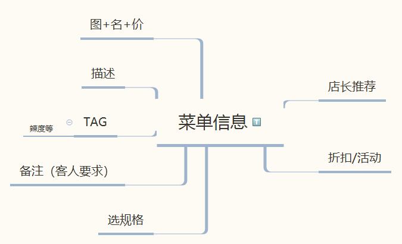

# KickOff Meeting Record

`2018/3/22 21:30 - 22:45`

**会议目标：**
交流按照约定搜集和了解的资料，就Inception阶段的任务讨论达成共识

## 议程
1. 定义领域问题，我们要做什么，解决什么问题？web还是小程序？
2. 收益？商业模式
3. 可行性分析（市场、竞品），要考虑什么系统特性
4. 给出故事，建立初步用例模型
5. 了解软件产品的风险评估，测试要做什么准备？
6. 实现工作可以开始做什么准备？云服务？有什么架构和组件可以考虑？（确定需要用到的技术）
7. 制定开发计划，至少第一个迭代

## 讨论结果
1. 确定核心业务流程：

顾客就座后扫描桌面二维码，查看电子菜单，自助点餐，后厨分单制作，服务员送餐至对应桌位，需要买单时，直接通过扫描二维码 在线支付即可，至此顾客完成整个用餐流程。

2. 愿景：

一方面提升顾客的就餐体验，优化用餐过程中几个流程：排队取号，纸质菜单点餐（服务员要等就影响了其他顾客点餐），收银员手动下单结算。 

另一方面，对餐饮企业来说，用直接和一体化的流程解决了餐饮体系的管理漏洞：包括舞弊、跑单、出错、丢单、效率低。

3. 可行性分析：

市场前景很好，线上选餐支付是趋势和潮流，短时间刷脸支付还不能推广开来。 

但是竞品很多，不乏看起来很好的。但是基本上都无法通过“下载使用”的方式做进一步了解，都是付费产品，所以竞品分析需要进一步研究，也许可以做调研和访谈。

另一方面，我们要在竞品中脱颖而出就要做出特色。目前我们致力于提供最优的性能和最好的用户体验。

4. 技术形式：

结合网上资料分析，可用的技术大概是web、H5或者小程序。各有优劣，所以决定回去再做技术调研，试着写demo来最后确定使用什么技术。

5. 初步搜集和讨论了需求：

 

6.其他约定：

定了项目名字Baoleme(饱了么)  
后续工作的准备和贡献计算