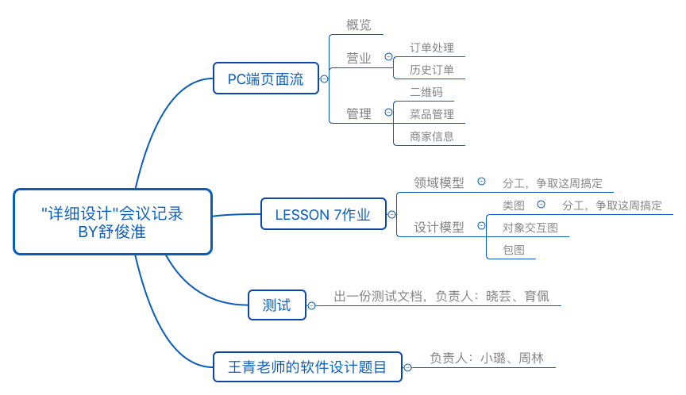

# Meeting Record of detail Design

`2018/4/17 21:00 - 22:25`

**会议目标：**
根据lesson 7作业讨论分工；讨论PC端页面流程图

## 议程

1. PC端界面约定
2. logo的讨论？
3. 领域模型到设计模型——团队作业，issue？
4. 设计模型：类图、对象交互图、包图
5. 领域模型exclude小票，避免周边计算添加适当冗余
6. 确定迭代开发目标？
7. PC端登陆注册流程工作
8. 王青老师的那个“软件设计题目”
9. 测试工作

## 讨论结果

1. 确定了PC端页面跳转的整体逻辑

   - 概览
   - 营业
     - 订单处理
     - 历史订单
   - 管理
     - 菜品管理
     - 二维码
     - 商家信息

   P.S. 页面之间的跳转关系还未确定

2. 确定了lesson 7 作业的分工

   - 领域模型任务：周林、杨小璐、朱育佩、李晓芸
   - 类图任务：朱楚、周长安、舒俊淮

3. 确定了测试方面下阶段的任务及其负责人

   - 任务：出一份测试文档，总体说一下应该要进行哪些测试、怎么测试、什么时候测试
   - 负责人：李晓芸、朱育佩

4. 确定了王青老师的软件设计题目的负责人：周林、杨小璐

### 本周分工

- 见“讨论结果”第一部分
- PC端的登录注册UI已经出了初稿，可以开始细化UI
  - 舒俊淮

## 记录会议“思维导图”

