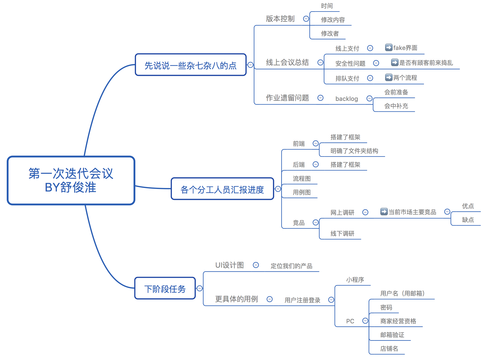
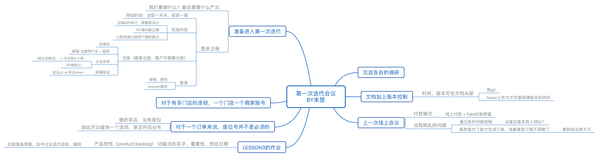

# Meeting Record of Iteration1

`2018/3/29 21:30 - 22:45`

**会议目标：**
交流所做的调研和准备，确定核心需求，就第一轮迭代阶段的任务讨论达成共识

## 议程

1. 约定需求文档的版本控制格式。愿景文档可能要重写，参考SWOT模型。
2. 约定Tower以后只放阶段性成果
3. 交流各自的成果
4. backlog & sprint plan
   1. 本轮迭代目标
   2. 参与人员以及投入程度
   3. sprint backlog
   4. 成果展示
5. 需求分析与测试工作的准备
6. Iteration 1阶段的安排
   1. 技术大佬先开始做，然后其他人先去学习相关技术？
   2. 开发安排：分工为：PC端、小程序端、后端
   3. 开发上的约束
7. 商量调整开会时间

## 讨论结果

1. 关于版本控制
   1. 使用git来做版本控制
   2. tower上作为文件里程碑版本的同步
2. 关于线上支付
   - 默认线上付款，因微信支付的限制，决定使用fake付款界面
3. 关于是否有顾客前来捣乱的问题，先按下不管
4. 明确了backlog为何物以及怎么使用
5. 明确了我们的产品定位
   - 只为零散商铺服务，不涉及大型连锁店如COCO奶茶店等
6. 确定第一次迭代任务
   1. UI设计图初稿
   2. 实现用户登录注册的功能
      1. 小程序端客户的登录
      2. PC端商家的注册登录
      3. 后端API设计、数据库设计
7. 确定以后开会的新的固定时间

### 第一个迭代分工

- 后端API设计、数据库设计：周长安
- 小程序端客户的登录：朱楚
- PC端商家的注册登录：舒俊淮
- 进一步讨论更具体的用例等：周林、朱育佩、杨小璐、李晓芸

## 记录会议“思维导图”

