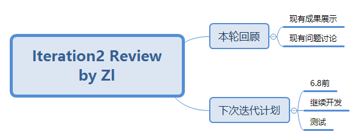

# Meeting Record of Iteration2 Review

`2018/5/25 16：00 - 17：00`

**会议目标：**
汇报上次迭代的成果以及遇到的问题，确定下次迭代的内容

## 议程

1. 本轮迭代完成度回顾
2. 下面的目标

## 讨论结果

1. 客户端下单-商家端订单处理展示  
原定本次迭代完成backlog2 3 5 7，目前PC完成约80%，还差一些对接工作，超额完成backlog8。  
本次会议比原定迭代日期迟了两周，一是UI迟了一周，而是上周SSD和建模练习作业任务较重，现在的进度可以接受。
2. 商家端现存问题
    - UI的动态滚动问题，顶部菜单栏是否固定（固定）：订单详情标题固定，下面滚动
    - 等待时间：从商家接单开始计算
    - 订单排序：查看全部订单按照最后更新的时间来排序（交给后端）
    - 辣度：添加额外字段(交给后端）
    - 菜品名仅限于中文不太合理：（修改成不限于中文，可以是表情）
    - 菜品管理UI还没对接：（下次迭代）
    - 订单查询方面，搜索框搜索的内容是什么？是改成查询准确的订单号吗？还是模糊搜索全部字段？：模糊搜索全部字段（交给后端）
3. 小程序端现存问题
    - 支付页面UI还没出来，该页面还没写
    - 如果要通过微信扫码进入小程序，需要审核上线，不知道能否通过
4. 下次迭代计划  
考虑到组内同学6月8日有课程期末考试，因此接下来这次迭代定在6.8之前。

### 接下来两周的任务（6.8前）
1. 彻底完成菜品管理和订单管理两个backlog，解决上述问题。
2. 完成核心业务的测试

## 记录会议“思维导图”

